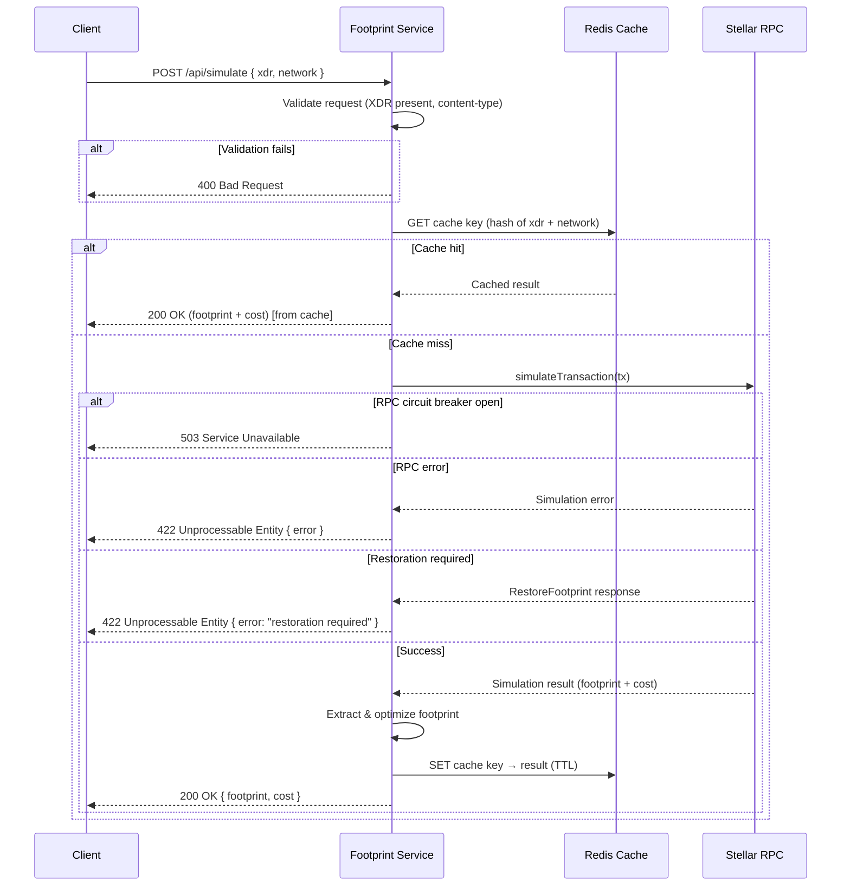

# Architecture

This document explains the internal design of the Stellar Footprint Service — how a request flows through the system, what each component does, and why key decisions were made.

## Overview

The service sits between a client (frontend or backend) and the Stellar RPC network. Its job is to take a raw transaction XDR, simulate it against the network, extract and optimize the footprint, and return the result — without the client needing to know anything about Soroban's pre-flight requirements.

## Request Flow

## Components

### Middleware Stack

Requests pass through the following middleware in order before reaching a controller:

| Middleware | Purpose |
|---|---|
| `contentType` | Rejects requests without `application/json` content-type |
| `ipFilter` | Enforces IP allowlist / blocklist from env vars |
| `bruteForce` | Delays then blocks IPs that exceed request thresholds |
| `rateLimiter` | Caps requests per IP per time window |
| `requestLogger` | Logs method, path, status, and duration |
| `responseTime` | Attaches `X-Response-Time` header |
| `timeout` | Aborts requests that exceed `SIMULATE_TIMEOUT_MS` |
| `metrics` | Records Prometheus counters and histograms |

### Cache (`src/services/cache.ts`)

Redis is used to cache simulation results keyed by a hash of the XDR and network. This avoids redundant RPC calls for identical transactions, which is common in frontend flows where the same unsigned transaction is simulated multiple times.

Cache TTL is configurable. On a cache miss the result is stored after a successful simulation.

### Circuit Breaker (`src/utils/circuitBreaker.ts`)

Wraps all outbound RPC calls. After `CB_FAILURE_THRESHOLD` consecutive failures the circuit opens and requests fail fast with a 503 until `CB_RECOVERY_MS` has elapsed. This prevents the service from hammering an unresponsive RPC endpoint.

### Simulator (`src/services/simulator.ts`)

Calls `simulateTransaction` on the Stellar RPC server. Handles three distinct response types:

- **Success** — proceeds to footprint extraction
- **SimulationError** — returns the RPC error message to the client as a 422
- **RestoreFootprint** — signals that one or more ledger entries have expired and must be restored before the transaction can be simulated; returned as a 422 with a descriptive message

### Footprint Extractor & Optimizer (`src/services/footprintExtractor.ts`, `src/services/optimizer.ts`)

After a successful simulation the raw footprint is extracted from the `SorobanTransactionData` and then passed through the optimizer, which removes ledger entries that are not actually needed by the transaction. This reduces the resource fee the user will pay when they submit the final transaction.

### RPC Client (`src/services/rpcClient.ts`)

Manages `SorobanRpc.Server` instances per network with connection pooling. Instances are reused for `RPC_POOL_TTL_MS` before being recreated, avoiding the overhead of establishing a new connection on every request.

## Error Paths

| Scenario | HTTP Status | Response |
|---|---|---|
| Missing `xdr` field | 400 | `{ "error": "Missing required field: xdr" }` |
| Invalid content-type | 415 | `{ "error": "..." }` |
| IP blocked | 403 | `{ "error": "Forbidden" }` |
| Rate limit exceeded | 429 | `{ "error": "Too many requests" }` |
| Request timeout | 408 | `{ "error": "Request timeout" }` |
| RPC simulation error | 422 | `{ "success": false, "error": "<rpc message>" }` |
| Restoration required | 422 | `{ "success": false, "error": "restoration required" }` |
| Circuit breaker open | 503 | `{ "error": "Service unavailable" }` |
| Unexpected server error | 500 | `{ "error": "<message>" }` |

## Network Support

The service supports `testnet` and `mainnet` simultaneously. The target network is specified per-request via the `network` field in the request body and defaults to `testnet`. Each network has its own RPC URL, network passphrase, and optional secret key configured via environment variables.

## Observability

- **Prometheus** metrics are exposed at `GET /metrics` and scraped by the bundled Prometheus container
- **Grafana** dashboards (under `monitoring/grafana/`) visualize request rates, latency percentiles, cache hit ratio, and circuit breaker state
- **Structured logs** are emitted via the request logger middleware for every request
